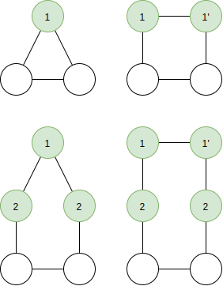

Design a deterministic distributed algorithm that solves the following problem in time $o(n)$ in the `Local` model.

**Input**: A network that is a cycle graph, that is, connected $2$-regular graph. Each node has a unique identifier and knowns the number of nodes $n≥3$.

**Output**: Finds a minimal [total dominating set](http://mathworld.wolfram.com/TotalDominatingSet.html) $S$. 

Total dominating set $T$ is a dominating set where, for each node $u∈T$ there exists $v∈T$ such that $u$ and $v$ are adjacent.

---

Each node has the following attributes.

- $id$: An unique indentifier.
- $n$: The number of nodes in the network.
- $id^{min}$: A variable for finding the leader. Initially the nodes own $id$.
- $s∈\{0,1\}$: An indicator whether the node belongs to the set $S$. One indicates that node belongs to the set $S$. Initially $0$.
<!-- - $m$:  initially 0 -->

The algorithm works as follows.

1) In $n$ rounds we determine the smallest unique identifier of all nodes.
   - Each nodes sends the value $id^{min}$ to its neighbors.
   - Each nodes receives the values $id_u^{min}$ and $id_v^{min}$ from neighbors $u$ and $v$, and then sets the new value $id^{min}=\min\{id_u^{min}, id_v^{min}\}.$

2) The node with the smallest unique identifier will identify itself as the leader and sets its indicator $s=1.$

3) If $n$ is even, in $2$ rounds we determine the smallest unique identifier next to the leader and set its indicator $s=1.$ 
   - Each nodes sends $id$ to its neighbors. 
   - Each nodes receives the values $id_u$ and $id_v$ from neighbors $u$ and $v$, and then sends the value $x=\min\{id_u, id_v\}$ and an indicator $l∈\{0,1\}$ whether the node is the leader.
   - If the node receives $l=1$ and $x=id$, it sets $s=1.$

    For odd $n$ we do nothing.

4) In $⌊(n-2-1)/2⌋$ rounds we can determine the rest of the nodes in the minimal total dominating set $S$.
   - Each node sends the value $s$ to its neighbors. 
   - Each node receives the values $s_u$ and $s_v$ from it neighbors $u$ and $v$ and will set $s=\max\{s_u, s_v\}$, that is, if one of its neighbors belong to $S$ this node will also belong to $S$.

Now, all the nodes that have indicator $s=1$ are in the minimal total dominating set $S$. This algorithm runs in $O(n)$ rounds.

TODO: prove correctness, graph with $n$ nodes

TODO: prove $o(n)$ rounds

<!-- # References -->
