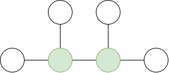
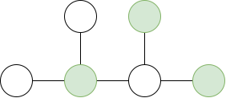

## Exercise 3.4
Exercise 3.4 in @distributed_algorithms.

Let $G=(V,E)$ be a graph.

### a)
Let subset $X⊆V$ be a maximal independent set.

Therefore, each vertex $v∉X$ has at least one edge $e=(v,u)$ in where $u∈X$. Otherwise, the vertex $v$ could be greedily added to the set $X$ and $X$ would not be maximal independent set. This means that each vertex $v∉X$ has at least one neighbor in $X$, and therefore $X$ is also a **dominating set**.

Dominating set is **minimal** because we can't greedily remove any vertex $v$ from $X$. If we removed a vertex $v$ from $X$, vertex $v$ would not have any neighbors in $X$ because $X$ is maximal independent set which prohibits the existence of edge with both endpoints in $X$, and therefore $X$ would no longer be a dominating set.

### b)

Let subset $X⊆V$ be a minimal dominating set such that there exist two vertices $u,v∈X$ such that there is edge $(u,v)∈E$. Therefore, $X$ cannot be a maximal independent set because it violates the condition that each edge has at most one endpoint in $X$. 

An example can be seen in figure \ref{fig1}.

### c)

<!-- Let subset $X⊆V$ be a minimum maximal independent set. -->

Example of a minimum maximal independent set, that is minimum dominating set can be seen in figure \ref{fig2}.

## References
