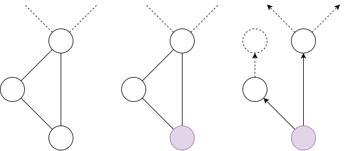

# Exercise 6.1
Exercise 6.1 in @distributed_algorithms.

The following prior algorithms have message size in $O(\log n)$ and therefore can be run on the CONGEST model.

1) `BMM`: Each node can send one message from the set of messages $\{proposal, matched, accepts\}$. 

2) `BDGreedy`: Each node can send its current color to its neighbors.

3) `BPGreedy`: Like `BDGreedy`, nodes can send their current colors to their neighbors.

# Exercise 6.2
Exercise 6.1 in @distributed_algorithms.

**Problem**: Let $G=(V,E)$ be a connected graph. Each node has to output the value edge count $|E|$ using the `CONGEST` model in $O(\operatorname{diam}(G))$ rounds.

---

Choose a leader node using the algorithm `LEADER`. It runs in $O(\operatorname{diam}(G))$ rounds.

Construct a *directed tree* $G'=(V',E')$ using modified `BFS` starting from the leader node. When traverses an edge and encounters a node that has been already encountered it initializes an edge to a virtual node. It also runs in $O(\operatorname{diam}(G))$ rounds.

Each node maintains :

* The set of edges to its children on the directed tree. Initially, the set is empty.

<!-- * Distance from leader which is counted using `BFS`. Initially, the value is zero. -->

* A set of edge counts of each of its children nodes on the directed tree. Initially, all values are zero.

After the directed tree is constructed, the algorithm runs as follows. Each communication round each node $v$

* Receives edge counts $c_u$ from its all of its children nodes $u$. The values are stored in the set of edge counts.

* Send its total edge count $c_v$ to its parent node. 

The edge count of node $v$ is calculated as the sum of the edge count of its children incremented by one which accounts for the edge from node $v$ to its children

$$c_v=∑_{u∈\operatorname{children}(v)} (c_u+1).$$

<!-- The operator $\operatorname{children}(v)$ denotes the set of children nodes of node $v$. -->

After $\operatorname{diam}(G)$ rounds the edge count has reached the leader node. The leader node will now propagate the edge count to all nodes using the directed tree. This takes another $\operatorname{diam}(G)$ rounds.

Therefore, the algorithm in total will run in $O(\operatorname{diam}(G))$ rounds.

# References
