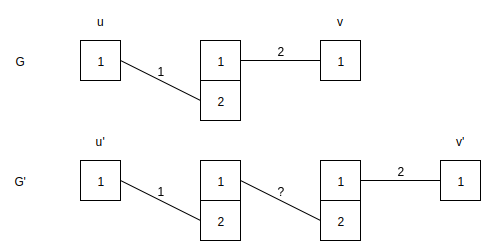
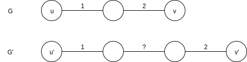

# Exercise 9.1
Exercise 9.1 in @distributed_algorithms.

## (a)
Deterministic algorithm for 2-edge coloring a path graph in the `PN` model in $O(n)$

A *port connection pair* from port $(u,i)$ to $(v,i')$ as pair $(i,i')$. In path graph, the set of possible port numbers are $\{1, 2\}$.

1) Propagate the port connection pair from each end node and its neighbor to the other end node. This takes $O(n)$ rounds.

2) Each end node compares the pairs in $O(1)$ rounds.

   a) If the pairs are equal, both end nodes start from step (3). This indicates that the path has even number of nodes and thus odd number of edges.

   b) If the pairs are unequal, the end node with port connection pair $(1, 1)$ starts from step (3).

3) From the selected end node(s), start coloring the adjacent edge with color $1$, then its adjacent nodes with color $2$, and so forth until all edges are colored. This takes $O(n)$ rounds.

## (b)

Let $A'$ be a deterministic 2-edge coloring algorithm for path graphs in the `PN` model in $o(n)$.

1) Let $G$ and $G'$ be port-numbered graphs. 

2) Nodes $u$ and $u'$ have isomorphic radius-1 neighborhoods. Then $A'$ will color their adjacent edges with same colors. This is also true for nodes $v$ and $v'$.

3) However, this lead to contradiction in graph $G'$ since using either color $1$ or $2$ for the edge in between doesn't lead to a proper $2$-coloring.

## (c)

Similarly to section [(b)](#b) the `LOCAL` algorithm using unique indentifiers will lead to contradiction.

# References
